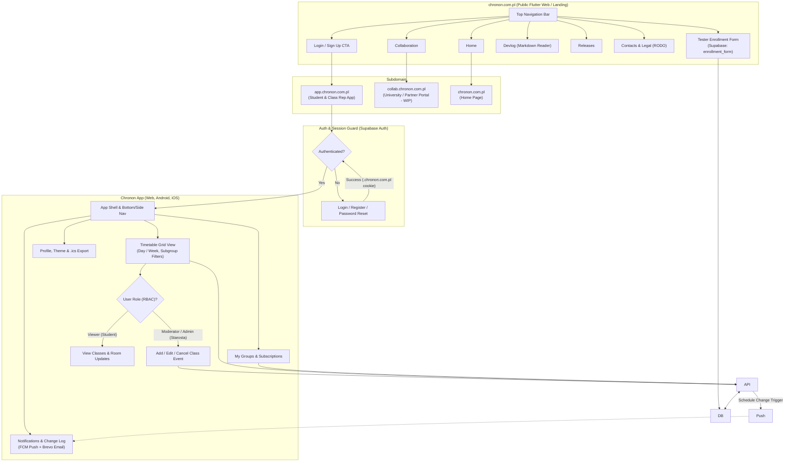

# Structure of frontend

###

```mermaid
flowchart TD
    subgraph PublicWeb["chronon.com.pl (Public Flutter Web / Landing)"]
        direction TB
        Nav["Top Navigation Bar"]
        Nav --> AuthBtns["Login / Sign Up CTA"]
        Nav --> Home["Home"]
        Nav --> BetaForm["Tester Enrollment Form<br/>(Supabase: enrollment_form)"]
        Nav --> Devlog["Devlog (Markdown Reader)"]
        Nav --> Releases["Releases"]
        Nav --> Contacts["Contacts & Legal (RODO)"]
        Nav --> Collaborations["Collaboration"]
    end

    subgraph Subdomains["Subdomain"]
        AppSub["app.chronon.com.pl<br/>(Student & Class Rep App)"]
        CollabSub["collab.chronon.com.pl<br/>(University / Partner Portal - WIP)"]
        HomeSub["chronon.com.pl<br/>(Home Page)"]
    end

    AuthBtns --> AppSub
    Home --> HomeSub
    Collaborations --> CollabSub

    subgraph AuthLayer["Auth & Session Guard (Supabase Auth)"]
        AppSub --> AuthCheck{"Authenticated?"}
        AuthCheck -- "No" --> AuthScreen["Login / Register / Password Reset"]
        AuthScreen -- "Success (.chronon.com.pl cookie)" --> AuthCheck
    end

    subgraph FlutterApp["Chronon App (Web, Android, iOS)"]
        AuthCheck -- "Yes" --> MainShell["App Shell & Bottom/Side Nav"]

        MainShell --> Timetable["Timetable Grid View<br/>(Day / Week, Subgroup Filters)"]
        MainShell --> Groups["My Groups & Subscriptions"]
        MainShell --> Alerts["Notifications & Change Log<br/>(FCM Push + Brevo Email)"]
        MainShell --> Settings["Profile, Theme & .ics Export"]

        Timetable --> RoleCheck{"User Role (RBAC)?"}
        RoleCheck -- "Viewer (Student)" --> ReadOnly["View Classes & Room Updates"]
        RoleCheck -- "Moderator / Admin (Starosta)" --> EditModal["Add / Edit / Cancel Class Event"]
    end

    BetaForm --> DB
    EditModal --> API
    Timetable --> API
    Groups --> API
    API <--> DB
    API -- "Schedule Change Trigger" --> Push
    Push -.-> Alerts
```